# BBRG Acquisition — Decision Map

Gart's LC issued, Tom pitched. Three gates — economics, trademarks, operating agreement — then the OA answer sets the closing structure.

```mermaid
%%{init: {
  "theme": "base",
  "flowchart": { "curve": "basis", "nodeSpacing": 45, "rankSpacing": 70, "padding": 12 },
  "themeVariables": {
    "fontFamily": "Georgia, 'Times New Roman', serif",
    "fontSize": "14px",
    "primaryColor": "#FDFDFB",
    "primaryTextColor": "#23272E",
    "primaryBorderColor": "#B9B4A7",
    "lineColor": "#8A8578",
    "edgeLabelBackground": "#F4F3EF",
    "clusterBkg": "#F4F3EF"
  }
}}%%
flowchart LR
    START(["<b>START</b><br/>Gart LC issued<br/>Tom pitched"]) --> P{"Tom takes buyer's case<br/>+ earnout?"}
    P -- "No — cash-only at $20M+" --> W1(["WALK"])
    P -- "Yes" --> DOCS["<b>TOM PULLS 3 DOCS FIRST</b><br/>1 · BBRG operating agreement<br/>2 · JJ&amp;N–BBRG trademark license<br/>3 · Franchise agreements + renewal files"]

    DOCS --> LIC{"Marks securable?<br/><i>JJ&amp;N sale, or license papered<br/>perpetual + CoC-proof</i>"}
    LIC -- "No" --> W2(["WALK<br/>never BBRG<br/>without marks"])
    LIC -- "Yes — each store's mark rights<br/>confirmed per its FA" --> OA{"<b>OA: drag-along?</b><br/>THE fork — sets<br/>closing structure"}

    OA -- "Drag exists · ideal" --> A4["<b>ONE SIGNING</b><br/>Tom + JJ&amp;N + partners<br/>same price, same day"] --> A5["Renewal calendar<br/>store buys, real estate"] --> A6(["<b>OUTCOME</b><br/>100% day one<br/>4% → 5% over 10 yrs"])

    OA -- "No drag, no block · base" --> B3["<b>CLOSE 1</b><br/>Tom's 55% + JJ&amp;N<br/>+ license together"] --> B4["Blended offer:<br/>45% + their 2 stores"] --> B5{"Accept?"}
    B5 -- "Yes" --> B7["Renewal calendar<br/>store buys, real estate"]
    B5 -- "Holdout" --> B6["Patience:<br/>first to sell wins"] --> B7
    B7 --> B8(["<b>OUTCOME</b><br/>same platform<br/>6–18 mo slower"])

    OA -- "Transfers blocked / ROFR · hard" --> C4["<b>FIVE-PARTY CLOSE</b><br/>Bret &amp; Mike in early<br/>everyone signs same day"] --> C5["Renewal calendar<br/>store buys, real estate"] --> C6(["<b>OUTCOME</b><br/>same platform<br/>all-or-nothing day"])

    classDef start fill:#23272E,stroke:#23272E,color:#F4F3EF
    classDef gate fill:#F4EAD3,stroke:#8A6420,color:#4A3510,stroke-width:1.5px
    classDef action fill:#E3EDF5,stroke:#2E5C7E,color:#17364E
    classDef step fill:#FDFDFB,stroke:#B9B4A7,color:#23272E
    classDef outcome fill:#E1EFE7,stroke:#1F6B47,color:#123A28,stroke-width:1.5px
    classDef walk fill:#F6E3E0,stroke:#8E2C25,color:#5A1712,stroke-width:1.5px

    class START start
    class P,LIC,OA,B5 gate
    class DOCS,A4,B3,C4 action
    class A5,B4,B6,B7,C5 step
    class A6,B8,C6 outcome
    class W1,W2 walk
```

## Diligence notes — the paper behind each box

The FDD is the map to every gate, but it only *summarizes*; the underlying contracts control.

| Section | Paper to pull | FDD basis · risk |
|---|---|---|
| **Gate 1 · Economics** | LOI with earnout schedule; Item 21 audited financials; Item 20 outlet history | The earnout is underwritten by the royalty stream the FDD proves up. If Item 21 can't support $20M cash, the earnout is the bridge — an all-cash demand means the seller's own numbers don't carry the price. That justifies the walk. |
| **Document pull** | Operating agreement; JJ&N–BBRG trademark license; FAs + renewal files | FDD Items 1, 13, and 17 point at all three, but disclosure summaries aren't contracts. Every downstream branch turns on the originals — pull before pricing. |
| **Gate 2 · Trademarks** | The license; USPTO registrations; each FA's mark-grant clause | Item 13 must disclose BBRG doesn't own its marks and every license condition. A license terminable on change of control means the acquisition could strip the brand — royalty contracts with nothing behind them, re-disclosed in an amended Item 13. Hence the hard walk unless JJ&N sells or re-papers perpetual + CoC-proof. |
| **Gate 3 · Operating agreement** | OA transfer article — drag, tag, ROFR, blocked transfers; member consents | Any track triggers Item 1 (new owner) and Item 21 (new financials) amendments before new franchise sales. Confirm FAs let the franchisor assign freely — a franchisee consent right in Item 17's contract terms changes every track's math. |
| **Track A · one signing** | — | One closing = one disclosure event (single Item 1/21 amendment). The 4%→5% step lands only at renewal per FA terms, disclosed in Items 5–6 of the successor FDD — the renewal calendar *is* the revenue plan. |
| **Track B · control first** | — | Operating with a 45% minority: any dispute lands in your own Item 3 (litigation), in front of every prospect. Partner stores transfer as franchisee transfers under Item 17 (consent, ROFR, fee). Patience beats a disclosable lawsuit — first to sell wins. |
| **Track C · five-party close** | — | ROFRs and blocked transfers put every signature on the critical path; OA notice periods set the closing clock. No lawful partial fallback, so Bret & Mike come in early. Post-close, same single Item 1/21 amendment as Track A. |

Every track ends the same way: renewals run on Item 17's windows and deadlines, store buys clear as franchisee transfers under the same item, and the royalty step-up appears in Items 5–6 of the successor FDD.
